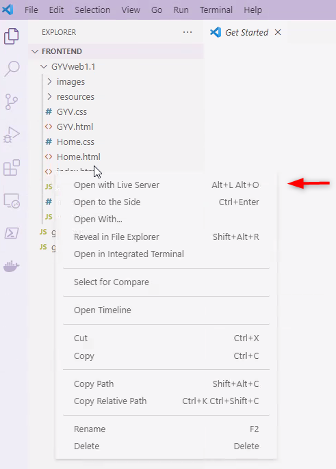
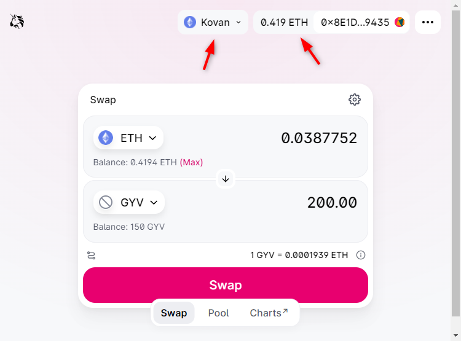
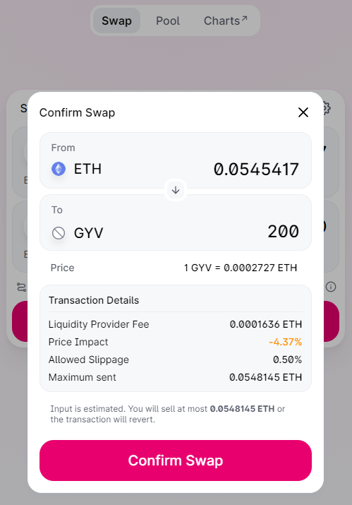
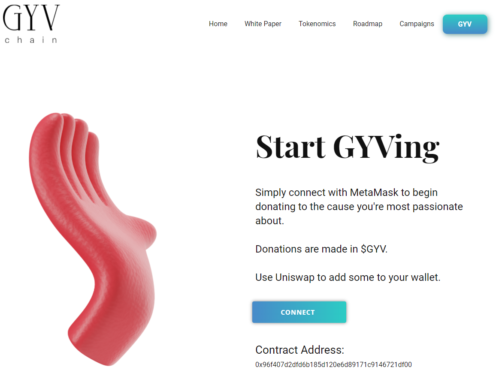
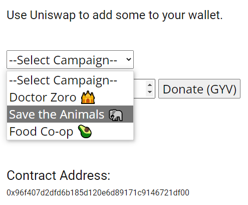
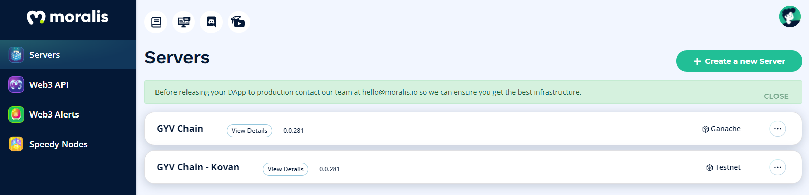
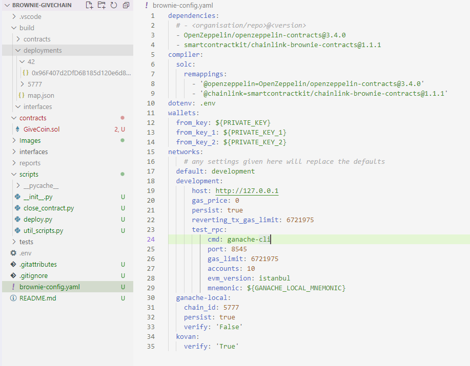

# gyvchaincore
This project is all about creating a blockchain solution for charity-related crowdfunding efforts.  The project and ideas around our implementation, originated from a discussion we had as a project team while participating in a Monash University Bootcamp.  From there, the ideas for this project took shape.

# Overview

> Charity through GYVing, a blockchain cryptocurrency solution to transparent, low cost and instant charity  
> \- Peter Eng, (ig) Novel Peace Prize Nominee 2021

GYV Chain is a platform that provides a layer 2 ERC-20 ethereum based blockchain solution for donors to directly share funds across the Internet to selected charity participants in a completely transparent, timely and economical way, reducing the cost of typical charity middleman-admin, management and marketing, while providing GYV Chain donors a reward for engaging in the platform.

There are over 48,000 Charities in Australia, of which about 20% are large, and 65% small; they receive less than $250,000 per annum, with half of those less than $50,000. Some of the key challenges for charities include high levels of cost for administration, marketing, customer support, operational and supply chain, finance and banking, regulatory and lobbying. All these costs reduce the percentage of funds that make it to the frontline of the charity where it is needed. In addition, many of the charities struggle to be seen or heard in a sea of good intentions.

The smaller, one could argue more effective Charities, tend to struggle making costs and other bits of internal info transparent and available for their donors without which, donor goodwill and ultimately more funds to continue good work, is compromised!

**Enter blockchain!** A technology that lends itself to this type of industry, where the types of information that make a difference are made available transparently, on the blockchain for all to see. 

Our platform, GVY Chain, is designed to address these charitable challenges by providing an instant, transparent, and low-cost vehicle to transfer funds immediately and directly from donor to frontline charity recipients where they can do what they do best.  This allows charities to move from "web page presence" to Web3 interactivity, providing a new - arguably future-proof - channel for fund raising.

Donors give because it makes them feel good, however sometimes they are reticent to give if they are not sure where their hard-earned money is being spent. For donors, GYV Chain provides the opportunity to connect to charities, particularly small, frontline charities and directly fund a chosen cause without having to be concerned with where their hard-earned cash ends up. Furthermore, they are rewarded for doing so; win-win!

As a concept, GYV Chain is an early representation of the potential and capacity of blockchain and smart-contracts to support the real-world (not the ritsy-ditsy ivory tower one) and in particular, maintain the transparency and veracity of charitable activities.  We're that passionate, that we think anyone would be hard pressed to see how this won't be the future of charitable GYVing!

## Instructions

Here are a few little points on how to prep for the firing up of our home page and then actually donating!

**Site**
- "Download" this very project from GitHub (select "download.zip" by pressing the CODE button) and open the zip file
- Be sure to unzip the file to ensure the pages load correctly
- Using VSCode and the LiveServer Plugin (or Python's webserver or another option), right-click `./frontend/GYVweb1.1/index.html` and select "Open with Live Server".

  

**Metamask**
- Prepare for a donation by setting up MetaMask (a secure wallet, easy to use)
  - MetaMask has a great starter article [here](https://metamask.zendesk.com/hc/en-us/articles/360015489531-Getting-started-with-MetaMask)
  - Add Ethereum to your wallet.  NOTE: this needs to be done on the Kovan Testnet using what is known as a faucet, a.k.a a tap :)
  - A really good faucet can be found [here](https://faucets.chain.link/kovan)
  - Learn more about the great things the Kovan Team are doing [here](https://kovan-testnet.github.io/website/)  

**Uniswap**
- In order to donate, one would need to go to Uniswap, [here](https://app.uniswap.org/#/swap).
  - Make sure Metamask is connected to "Kovan Test Network"
- Ensure that ETH is shown in the upper swap dialogue box

  

- In order to swap ETH for GYV, use the drop down on the lower swap dialogue box
- Copy the following address 0x96F407d2DfD6B185d120e6d89171c9146721DF00 and paste it into this lower swap dialogue box "search name or paste address" (under "Select a Token")
- The GYV token will appear in the list and you can now add this to your swappable token list
> Having completed this one-time set of steps, you will not need to do so again as the token has now been added to your wallet
- Swap the Ethereum you've just added to your wallet for GYV (as below)

  

- If you return to your Metamask wallet, you can now add GYV to your assets
- Now you're in a position to donate!!!
- From here on you can open Uniswap and immediately swap ETH for GYV

What follows is all you need to know about the Frontend, and donating to your cause!  

## Frontend

We laboured for many hours, downing many cups of coffee, losing many coins to the swear jar (literally) ... but in the end we got there.  We built the site from a website template and added in the bits and pieces we needed to accomplish the vision.

MetaMask integration with the Ethereum Testnet, our test wallets and the backend, all came together to make it work.  A little bit about the site and tools used, follows.

### **Home Page**

This is the landing page for the site, and briefly lays out what we're about.  As one descends the page, the why is explained/revealed, touching on the tokenomics, the roadmap and selected/highlighted mock charity campaigns one can donate to and of course a number of links and buttons directing the user/donor to the "GYV" page, where one can do what one has come to the site to do ... donate!!

Across the top of the page, one can select the different aspects mentioned above, including access to the Whitepaper itself.

  

### **GYV Page**

*The most important of all the pages!*  
The place where one can donate.  
The page responsible for all the coffee drunk and coins lost!

The "Connect" button is where the magic happens, calling the various bits of JavaScript that allow for the interaction with MetaMask, the integration to Moralis, then to the blockchain (Kovan Testnet in this case) and finally the call to the smart-contract processing the donation itself (see next section for example).

  

Once Metamask has been connected to the page, and in order to interact with the contract and complete donation, the Charity to which the donation is to be sent, must be selected.  As highlighted on the Home page, the charities in this project, were the 3 fictitious charities in the example below.

Once the Charity is selected, the "Donate (GYV)" button should be clicked to finalise the donation.  Metamask will prompt to confirm the gas fees ... and that is it!!  Gyving complete!

  

### **The Contract**

The contract was deployed on Kovan and is viewable to anyone on the planet at the Kovan-specific etherscan address, [here](https://kovan.etherscan.io/address/0x96F407d2DfD6B185d120e6d89171c9146721DF00).  

Along with viewing the contract itself, every transaction and/or interaction (donations, setting up campaigns, etc.) can also be viewed at the contract address.

The minting of $GYV was simulated upon deployment.  The initial supply was $GYV400,000,000 (see the Whitepaper for more), distributed to accounts which hold the various allocation of funds (see [this](https://kovan.etherscan.io/tx/0x4c16fb28a22df9dbca40fc2d7dd5649e2fdc5784062740b5a5752589ac686f48) transaction on Kovan's etherscan for the breakdown).

## Whitepaper

With any project around a blockchain platform, whether for real or a side-project, the whitepaper is, in our view, extremely important for a number of reasons.

- It allows the reader to understand the logic of the Project/Platform, the vision and what the project is trying to solve
- It clearly explains the tokenomics, integral to the smart-contract, without getting bogged down in the detail
- It highlights the next steps and roadmap for the platform and project

The current version of the whitepaper - always under review :) - is available [here](frontend/GYVweb1.1/resources/gyvchain_whitepaper_v1_1.pdf) or if you're having issues accessing it, here is the relative path: `frontend/GYVweb1.1/resources/gyvchain_whitepaper_v1_1.pdf`

## Tools used

### Remix - Solidity

Remix IDE allows developing, deploying and administering smart contracts for Ethereum like blockchains, including the ability to deploy them to an RPC network locally (using Ganache), or a Testnet such as Kovan (references in the document), Ropsten or Binance Smartchain.

### Moralis

Moralis provides a managed backend for blockchain projects. Automatically syncing the balances of your users into the database, allowing you to set up on-chain alerts, watch smart contract events, build indexes, and so much more. All features are accessed through an easy-to-use SDK or directly using their libraries (plugging in some good ol' JavaScript).

  

### Brownie

Brownie is a Python-based development and testing framework for smart contracts targeting the Ethereum Virtual Machine.  It allows one to programmatically/automatically compile, deploy and test smart-contracts and compatible with all Ethereum Testnets already mentioned.

  

### OpenZeppelin

As part of the contract creation, we used OpenZeppelin's standardised contract library, which allowed us to just think about our own logic and not to worry about writing in additional protections and utilities.  
 - We used the ERC20 token standard, available on GitHub [here](https://github.com/OpenZeppelin/openzeppelin-contracts/blob/release-v3.4/contracts/token/ERC20/ERC20.sol)
 - We used the re-entrancy guard utility token standard, also available on GitHub [here](https://github.com/OpenZeppelin/openzeppelin-contracts/blob/release-v3.4/contracts/utils/ReentrancyGuard.sol)

### Nicepage

For the website, we used Nicepage (learn more [here](https://nicepage.site/)) to create an initial template of what we wanted, into which we injected our Team's goodness, including the Whitepaper, the JavaScript interactions, the pages themselves, Moralis and MetaMask.

## Conclusion

### Challenges

Despite the tight time-constraints of this Project (all in full-time employment), we did limited testing of the ICO simulations, yet what was done, was successful.

The testing of *campaign creation*, *campaign approvals*, *donations* and then *concluding* those campaigns, transferring funds out to Charity addresses, was limited; those pesky ime-constraints again. It goes without saying then, that the testing we wanted to do with large amounts of ETH and GYV was just not possible, particularly because of the low supply of ETH. 

On that note, we were able to successfully create a Uniswap Liquidity Pool (Uniswap v3) and then swap ETH for GYV, but as mentioned, due to the shortage of GYV and low liquidity, we were not able to "go wild" and this limited testing with hundreds of addresses and/or with hundreds of thousands (heck, millions!) of GYV.

### What Next?

There is a lot of development work yet required for the frontend (HTML, CSS) and backend (JavaScript, MongoDB integration).  This is all required for some of the features we want to add on both sides of the equation, e.g. for donors and charities.  The contract needs more work, to finalise the tokenomics, iron out some of the kinks as well as make it more secure and inject some best-practice, not limited to the creation of a DAO. 

### Concluding thoughts

This particular project was pretty rewarding and that is a Team-wide conclusion!  Setting up this blockchain project, which seems at first glance to be fairly daunting, has not been at all. The varying passions this Team has for differing areas in life, have contributed well to the final result.

In the end, what we were able to do together has been superb.

## The Team!

Short intro into the Team involved in this little project.  We're a group with varying interests and careers, not specifically FinTech related, nor is the entire Team technically astute!  Having said that, the Team came together and contributed none-the-less.

- Andrew A. - the Neo
- Brian N. - the UXer
- Patrick K. - the Socialite
- Pete E. - the PM
- Sid T. - the contract Mad Hatter

# Acknowledgements and References

- Remix has been used as the IDE for this little project
- Ganache has also been used to help with the testing off-chain
- Brownie has been used to ease contract testing and deployment
- We made use of the Chainlink Faucet for the ETH used, find that [here](https://faucets.chain.link/kovan)
- For on-chain testing, we used the Kovan Testnet (more [here](https://kovan-testnet.github.io/website/))
- Learn all about OpenZeppelin and the standards of safety they provide at https://docs.openzeppelin.com but more specifically relating to ERC-20 [here](https://docs.openzeppelin.com/contracts/2.x/crowdsales)
- Ethereum Foundation needs to be acknowledged in general for their work, in their creation of their specific blockchain, allowing for the ecosystem to blossom as it currently has.
- Thanks to Trinity College, an organisation that has provided the training, which in turn has allowed for the creation of our project (as part of a Monash University Bootcamp).
